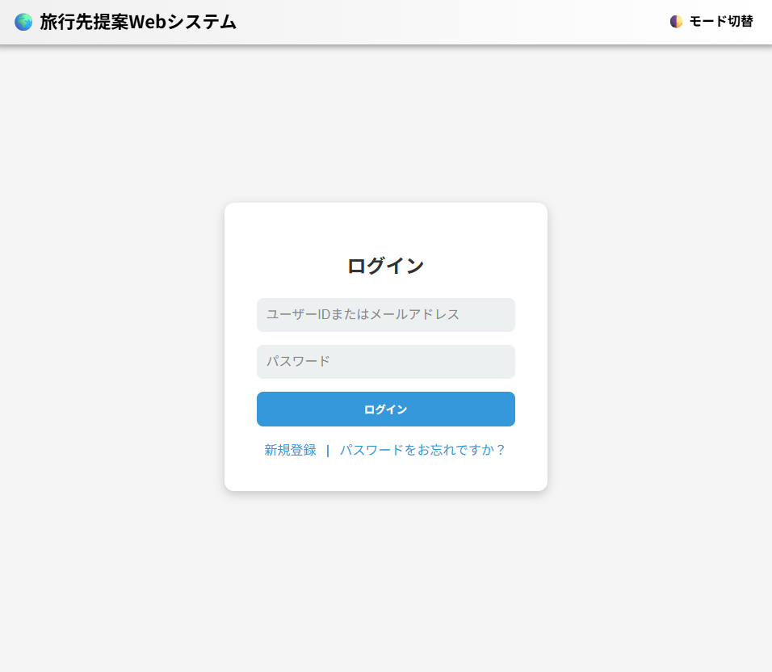
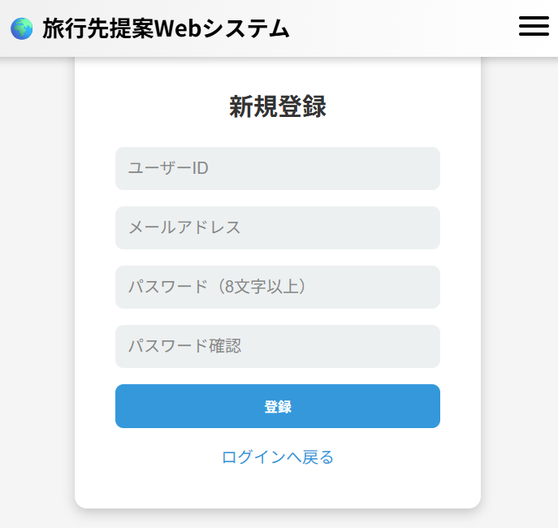
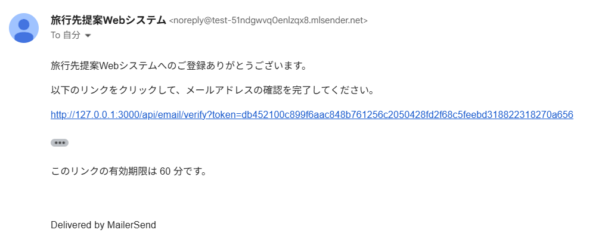
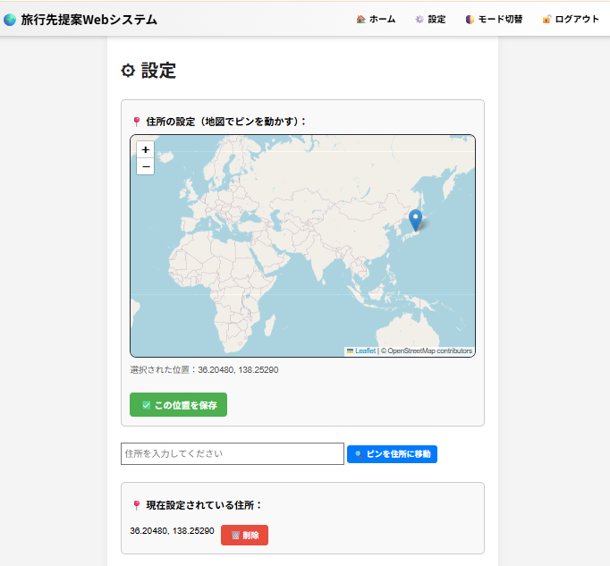
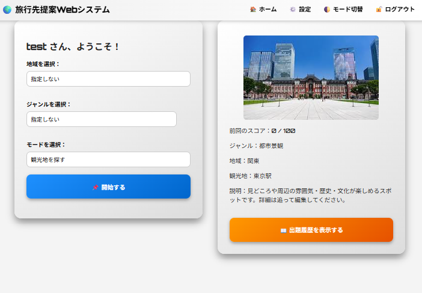
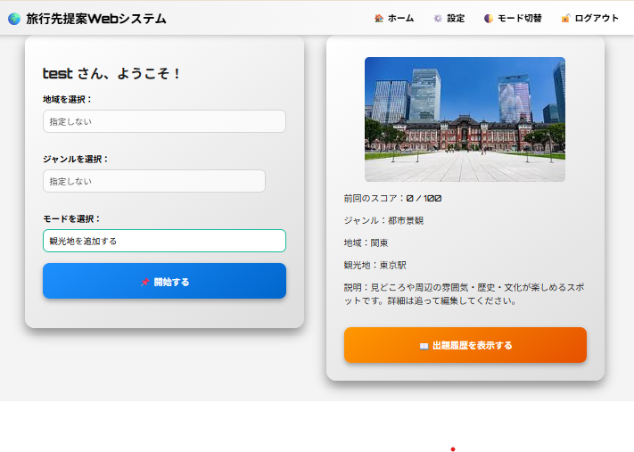
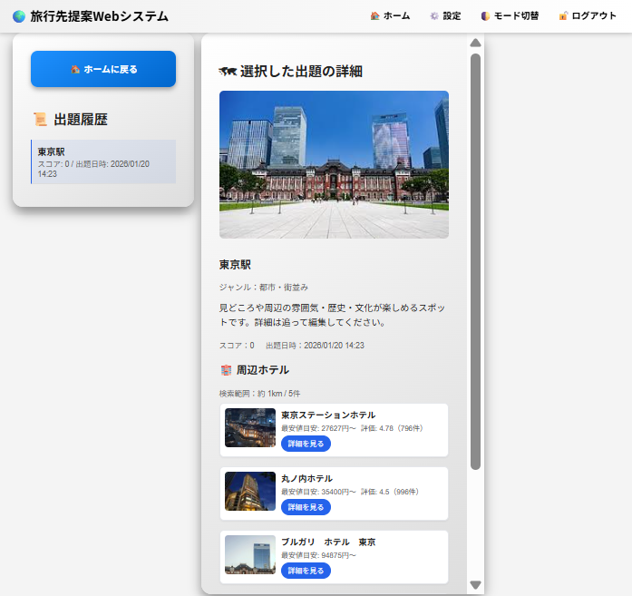
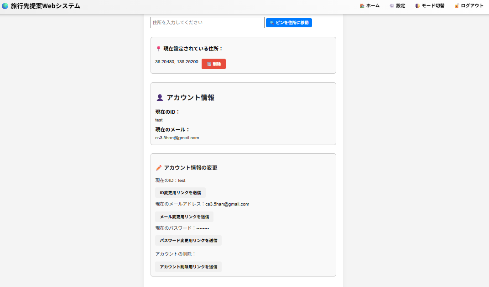

# 操作手順書（旅行先提案Webシステム ）

本書は、システム利用者がブラウザ上で各機能を操作するための手順をまとめたものである。  
画面の文言・ボタン名は、バージョンにより一部異なる場合がある。

---

## 1. 起動方法

### 1.1 開発モードで起動する

```bash
npm run dev
```

### 1.2 本番モードで起動する

```bash
npm run build
npm start
```

### 1.3 PM2 で起動する（任意）

```bash
pm2 start npm --name geo-app -- start
pm2 status
```

---

## 2. 画面を開く

ブラウザで以下にアクセスする。

```text
例: http://localhost:3000
```


---

## 3. ログイン／新規登録

### 3.1 ログインする


1. メールアドレスとパスワードを入力する。  
2. 「ログイン」ボタンを押す。  
3. ログインに成功すると、ホーム画面へ遷移する。  
   


### 3.2 新規登録する（初回のみ）

1. 「新規登録」または「サインアップ」を押す。  
2. 必要項目（メールアドレス、パスワード等）を入力する。  
3. 登録処理が完了するとログインできる。 


> ※ メール認証が送信されるため、実際に利用しているメールアドレスを利用して認証を完了してください。



---

## 4.　プレイ前の手順（住所の登録）

1. 設定画面を開く [(例: http://localhost:3000/settings)](http://localhost:3000/settings)
2. 地図から自分のおうちにピンを設定する。(住所の手入力は検索に引っかからない場合があります。) 
3. この位置を保存というボタンを押す。 


---

## 4.　プレイの手順（観光地を探す）

1. ホーム画面を開く [(例: http://localhost:3000/home)](http://localhost:3000/home)
2. 地域、ジャンルに指定があれば設定する。
3. モードを観光地を探すというモードにして"開始する"ボタンを押す。

4. 観光地が表示されるのでその場所を推測して右下の地図にピンを指す。
5. 回答が確定したら右上の確定ボタンを押す。
6. 自分の推測地域からの距離、自宅からの距離、近隣のホテル情報などが出るので必要であれば確認する。
7. ホーム画面に戻る。

> データベースに観光地が追加されていなければ観光地の追加を先に行ってください


## 5. 観光地の登録・保存

1. ホーム画面を開く [(例: http://localhost:3000/home)](http://localhost:3000/home) 
3. モードを観光地を探すというモードにして"開始する"ボタンを押す。

4. 観光地のタイトルを入力後、ピンの位置を設定しジャンル、 観光地の説明、観光地の写真をアップロードする。
> ### ピンの自動移動とAIを利用する場合
> 1. 観光地のタイトルを入力後下のAIを利用する場合"AIで自動生成"というボタンを押す。
> 2. 観光地を示すピンと観光地の説明が生成されるので確認する
> (観光地を示すピンは動かない場合が多々ある)
> 3. 観光地の写真をアップロードする。
5. "この観光地を追加"というボタンを押す。
6. 追加された観光地の確認画面に遷移するので内容を確認してホーム画面に行く。

---

## 6. 履歴の確認

1. メニューから右側の「出題履歴を表示する」ボタンを押す。  
2. 過去の解答　距離、スコア、日時、ホテル情報 などが表示される。


---

## 7. アカウント設定

1. 「設定」画面を開く。  
2. 下にスクロールしてユーザー名・メールアドレス・パスワードの変更・削除用メールの送信を行う。
  
3. メールに届いたリンクを開いて変更・削除を行う。

---

## 8. ログアウト

1. メニューから「ログアウト」を押す。  
2. ログイン画面へ戻る。  

---

## 9. 終了方法

### 9.1 開発モード（ターミナル）

- 起動しているターミナルで `Ctrl + C` を押す。

### 9.2 PM2 の場合

```bash
pm2 stop geo-app
```

---

## 10. 注意事項

- 起動できない場合は「環境開発構築手順書」のトラブルシューティングを参照すること。  
- `.env` のキー情報（APIキー等）は第三者に公開しないこと。  